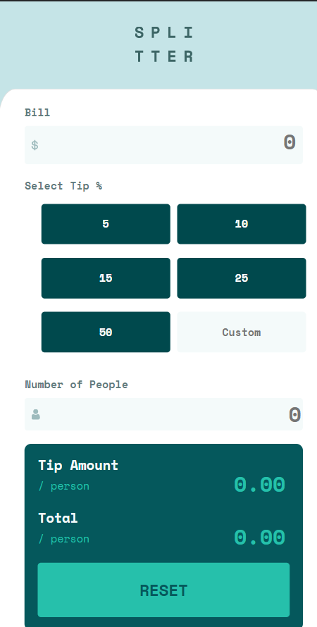

# html css javascript boilerplate - Tip calculator app 

This is a solution to the March-22-Batch-JavaScript-Project-
## Overview

### The challenge

Users should be able to:

- View the optimal layout for the app depending on their device's screen size
- See hover states for all interactive elements on the page
- Calculate the correct tip and total cost of the bill per person

### Screenshot

### Links

- Solution URL:https://github.com/sarikapanmand/March-22-Batch-JavaScript-Project---JavaScript-Project---lphrpv1ksiqz)-
- Live Site URL:https://sarikapanmand.github.io/March-22-Batch-JavaScript-Project---JavaScript-Project---lphrpv1ksiqz/ 
## My process

### Built with

- Semantic HTML5 markup
- CSS
- Flexbox
- CSS Grid
- Mobile-first workflow
- Vanilla JavaScript

## Getting started
To get a local copy up and running follow these simple example steps.

### Prerequisites
- Gitbash installed to navigate between the branches.
- A preferred text editor for example VS Code.

### Install
Clone this [GitHub Repo](sarikapanmand/March-22-Batch-JavaScript-Project---JavaScript-Project---lphrpv1ksiqz.git) to your computer on yourFolder by typing these commands in the terminal or download as a Zip file and extract.

$ mkdir yourFolder

$ cd yourFolder

$ git clone sarikapanmand/March-22-Batch-JavaScript-Project---JavaScript-Project---lphrpv1ksiqz.git

👤 **Author**

- Coded By:Sarika.karle@gmail.com
- GitHub: https://github.com/sarikapanmand

## Show your support

Give a ⭐️ if you like this project!

